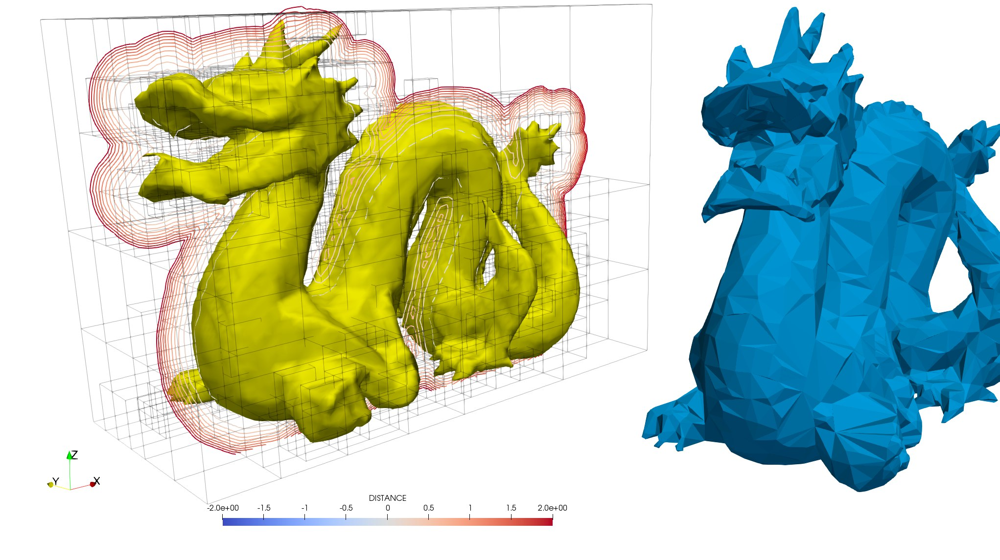

# FOSSIL 

### FOSSIL, FOrtran Stereo (si) Litography parser

+ FOSSIL is a pure Fortran (KISS) library for IO and manipulation of STL (Stereo Litography) files for modern (2003+) Fortran projects;
+ FOSSIL is Fortran 2003+ standard compliant;
- FOSSIL is OOP designed;
- FOSSIL is TDD designed;
+ FOSSIL is a Free, Open Source Project.

#### Issues

#### Compiler Support

---

[What is FOSSIL?](#what-is-fossil?) | [Main features](#main-features) | [Copyrights](#copyrights) | [Documentation](#documentation) | [A Taste of FOSSIL](#a-taste-of-fossil)

---

## What is FOSSIL?

FOSSIL is a pure Fortran (KISS) library for IO and manipulation of STL (Stereo Litography) files for modern (2003+) Fortran projects.

FOSSIL provides a simple API to IO STL files and also to manipulate the triangulated surface contained into the STL file.

Go to [Top](#top)

## Main features

* [X] User-friendly methods for IO STL files:
    * [x] input:
        * [x] automatic guessing of file format (ASCII or BINARY);
        * [x] automatic loading of all facets;
    * [x] output:
        * [x] automatic saving of all facets;
* [x] powerful surface manipulation:
    * [ ] sanitize normals:
        * [ ] reverse normals:
        * [ ] make normals consistent:
    * [x] compute minimal distance;
    * [x] point-in-polyhedron test for distance sign computation:
        * [x] by means of solid angle computation;
        * [x] by means of rays intersection count;
    * [ ] fill holes;
    * [ ] check watertight resistence;
* [ ] errors trapping mechanism.

Any feature request is welcome.

Go to [Top](#top)

## Copyrights

FOSSIL is an open source project, it is distributed under a multi-licensing system:

+ for FOSS projects:
  - [GPL v3](http://www.gnu.org/licenses/gpl-3.0.html);
+ for closed source/commercial projects:
  - [BSD 2-Clause](http://opensource.org/licenses/BSD-2-Clause);
  - [BSD 3-Clause](http://opensource.org/licenses/BSD-3-Clause);
  - [MIT](http://opensource.org/licenses/MIT).

Anyone is interest to use, to develop or to contribute to FOSSIL is welcome, feel free to select the license that best matches your soul!

More details can be found on [wiki](https://github.com/szaghi/FOSSIL/wiki/Copyrights).

Go to [Top](#top)

## Documentation

Besides this README file the FOSSIL documentation is contained into its own [wiki](https://github.com/szaghi/FOSSIL/wiki). Detailed documentation of the API is contained into the [GitHub Pages](http://szaghi.github.io/FOSSIL/index.html) that can also be created locally by means of [ford tool](https://github.com/cmacmackin/ford).

### A Taste of FOSSIL

To be written.

Go to [Top](#top)
